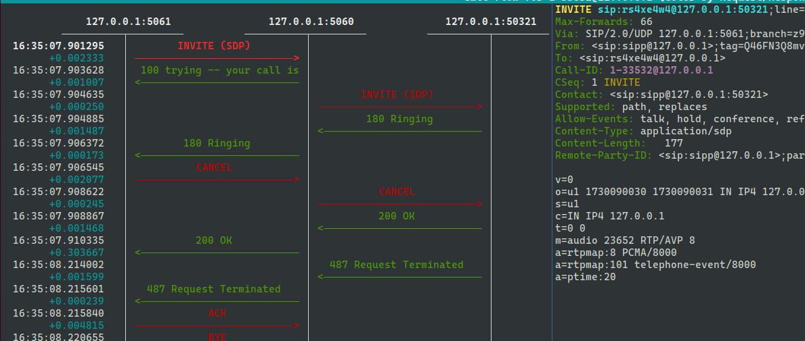
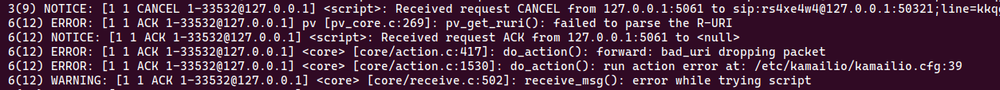
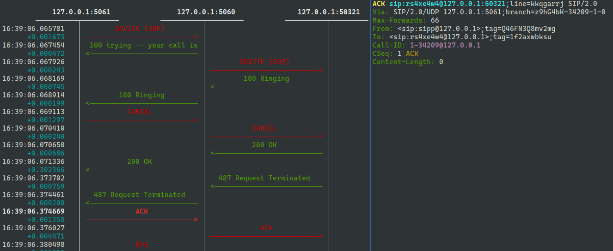

 - start kamailio
   
   docker run --net=host --name kamailio_tmp_topoh -v .:/etc/kamailio   kamailio/kamailio-ci

 - start uas
   
   ./uas.sh
   
 - start uac
   
   ./uac.sh

## WITH topoh

 
 

## WITHOUT topoh

 
